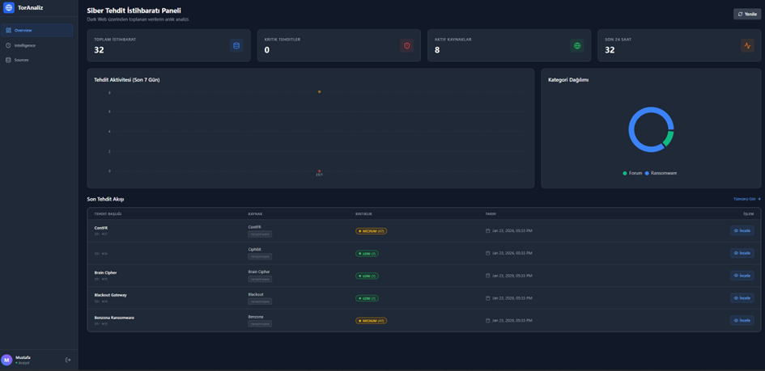
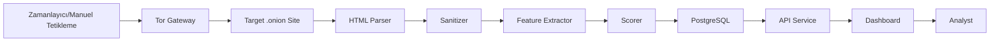
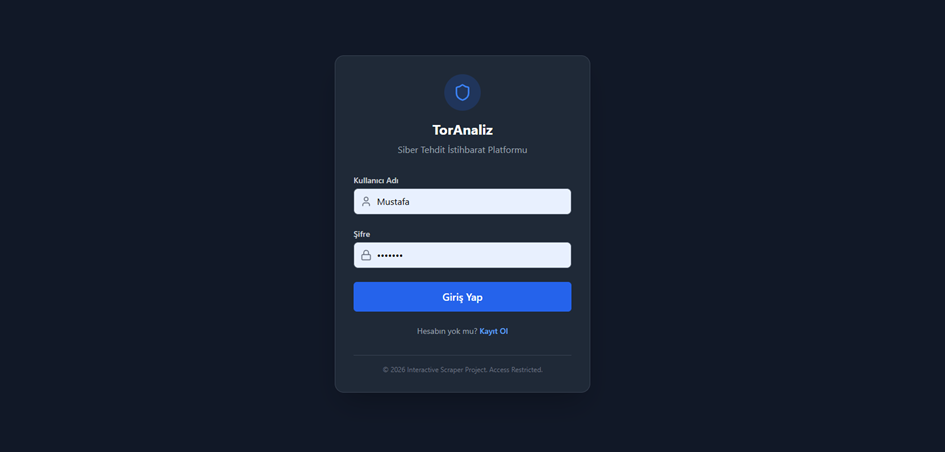
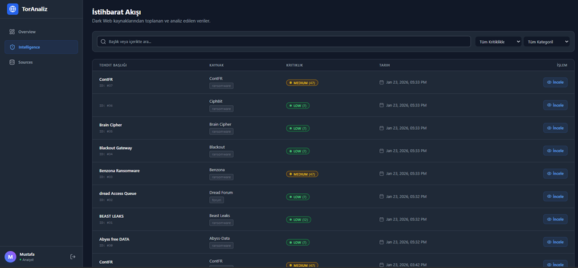
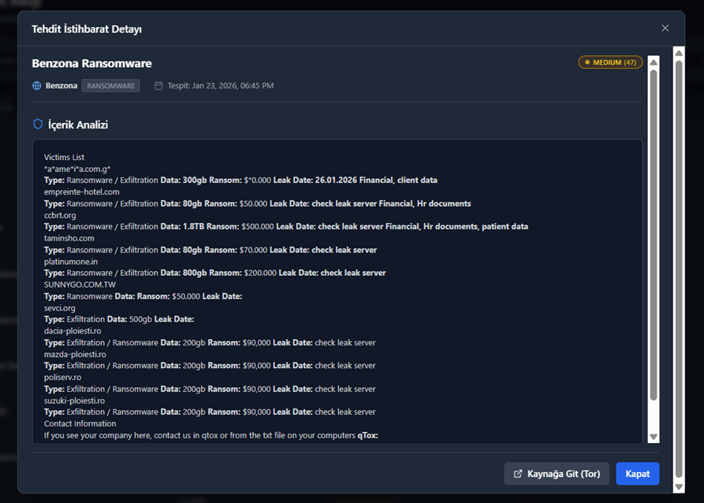
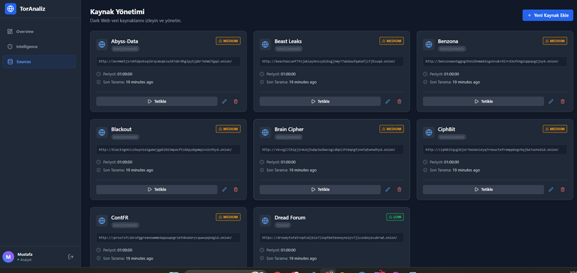
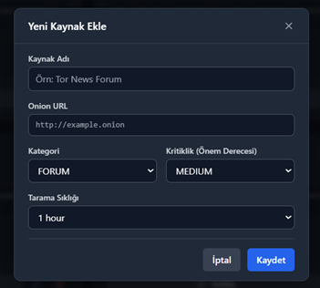

<div align="center">

# 🕵️ Interactive Scraper - CTI Platform

### Siber Tehdit İstihbaratı Toplama ve Görselleştirme Sistemi

[](https://opensource.org/licenses/MIT)
[](https://golang.org/)
[](https://reactjs.org/)
[](https://www.postgresql.org/)
[](https://www.docker.com/)
[](https://www.torproject.org/)



*Dark Web kaynaklarından etik ve yasal sınırlar içerisinde siber tehdit istihbaratı toplayan, işleyen ve görselleştiren mikroservis tabanlı platform.*

[🚀 Hızlı Başlangıç](#-hızlı-başlangıç) • [📚 Dokümantasyon](#-mimari-ve-tasarım) • [🎯 Özellikler](#-temel-özellikler) • [🛠️ Kurulum](#-kurulum-adımları)

</div>

---

## 📋 İçindekiler

- [Proje Hakkında](#-proje-hakkında)
- [Temel Özellikler](#-temel-özellikler)
- [Sistem Mimarisi](#-mimari-ve-tasarım)
- [Teknoloji Stack](#-teknoloji-stacki)
- [Kurulum](#-kurulum-adımları)
- [Kullanım](#-kullanım)
- [Ekran Görüntüleri](#-ekran-görüntüleri)
- [Güvenlik ve Etik](#-güvenlik-ve-etik)
- [Katkıda Bulunma](#-katkıda-bulunma)
- [Lisans](#-lisans)

---

## 🎯 Proje Hakkında

**Interactive Scraper**, Dark Web (Tor Network) üzerindeki tehdit aktörlerinin faaliyetlerini izlemek, analiz etmek ve görselleştirmek için geliştirilmiş kapsamlı bir **Siber Tehdit İstihbaratı (CTI)** platformudur.

### 🎯 Proje Hedefi

Siber güvenlik uzmanları ve analistler için:
- 🔍 **Dark Web kaynaklarından** güvenli veri toplama
- 🧹 **Veri temizleme ve işleme** otomasyonu
- 📊 **Görselleştirme ve analiz** araçları
- ⚡ **Gerçek zamanlı tehdit izleme** yetenekleri
- 🎨 **Kullanıcı dostu dashboard** arayüzü

### ⚖️ Etik ve Yasal Uyum

> ⚠️ **ÖNEMLİ**: Bu proje, yalnızca **yasal ve etik sınırlar** içerisinde çalışmak üzere tasarlanmıştır.

- ❌ Hiçbir zararlı dosya indirilmez veya saklanmaz
- ✅ Sadece metadata ve açıklama metinleri toplanır
- 🧹 Tüm veriler sanitizasyon katmanından geçer
- 📝 Yalnızca tehdit bildirim başlıkları ve açıklamaları işlenir

---

## ✨ Temel Özellikler

### 🔐 Güvenli Veri Toplama
- **Tor Network** entegrasyonu ile anonim erişim
- **Rate Limiting** ve jitter ile bot koruması bypass
- **Exponential Backoff** ile bağlantı yönetimi
- **Proxy tabanlı** izolasyon

### 🧠 Akıllı Veri İşleme
- **HTML to Markdown** dönüşümü
- **XSS ve injection** temizleme
- **Regex tabanlı** varlık tespiti (Bitcoin, CVE, IP)
- **Anahtar kelime** analizi ve frekans hesaplama

### 📊 Kritiklik Puanlama Sistemi
- **0-100 arası** otomatik skorlama
- **4 Seviye**: Düşük, Orta, Yüksek, Kritik
- **Dinamik ağırlıklandırma** algoritması
- **Renk kodlu** görsel önceliklendirme

### 🎨 Modern Dashboard
- **Gerçek zamanlı** veri akışı
- **İnteraktif filtreler** (Kategori, Kritiklik, Tarih)
- **Grafik ve istatistikler** (Recharts)
- **Detaylı içerik** analizi paneli
- **Kaynak yönetimi** arayüzü

---

## 🏗️ Mimari ve Tasarım

### Mikroservis Mimarisi

```
┌─────────────────────────────────────────────────────────────┐
│                     🌐 CLIENT (React)                       │
│                    Dashboard & UI                           │
└────────────────────────┬────────────────────────────────────┘
                         │ REST API
                         ▼
┌─────────────────────────────────────────────────────────────┐
│                    🔌 CTI-API (Gin)                         │
│              Authentication & Data Service                  │
└────────────┬────────────────────────────────┬───────────────┘
             │                                │
             ▼                                ▼
┌────────────────────────┐      ┌────────────────────────────┐
│  🕷️ CTI-SCRAPER        │      │  💾 CTI-DATABASE           │
│  ├─ Transport Layer    │◄────►│  ├─ intelligence_data     │
│  ├─ Parser Layer       │      │  ├─ sources               │
│  ├─ Sanitizer Layer    │      │  ├─ extracted_features    │
│  ├─ Extractor Layer    │      │  └─ users                 │
│  ├─ Scorer Layer       │      │     (PostgreSQL)          │
│  └─ Storage Layer      │      └────────────────────────────┘
└────────────┬───────────┘
             │ SOCKS5 Proxy
             ▼
┌────────────────────────┐
│  🧅 TOR-GATEWAY        │
│  Anonymous Network     │
│  Access (Port 9150)    │
└────────────────────────┘
```

### 📦 Sistem Bileşenleri

| Bileşen | Katman | Teknoloji | Görev |
|---------|--------|-----------|-------|
| **cti-tor-gateway** | Ağ Katmanı | Tor Proxy (Alpine) | Anonim Dark Web erişimi sağlar |
| **cti-scraper** | Veri Toplama | Go 1.21+ | HTML parsing, veri işleme, skorlama |
| **cti-database** | Veri Saklama | PostgreSQL 15 | İlişkisel veri yönetimi |
| **cti-api** | Servis Katmanı | Gin Gonic | RESTful API endpoint'leri |
| **cti-dashboard** | Sunum Katmanı | React + TailwindCSS | Kullanıcı arayüzü |

### 🔄 Veri Akış Döngüsü



---

## 🛠️ Teknoloji Stacki

### Backend

<div align="center">

| Teknoloji | Versiyon | Kullanım Alanı |
|-----------|----------|----------------|
|  | 1.21+ | Ana backend dili |
|  | 1.9+ | Web framework |
|  | 15 | Veritabanı |

</div>

**Go Kütüphaneleri:**
- `github.com/PuerkitoBio/goquery` - HTML parsing
- `github.com/JohannesKaufmann/html-to-markdown` - Markdown dönüşümü
- `github.com/microcosm-cc/bluemonday` - HTML sanitization
- `golang.org/x/time/rate` - Rate limiting

### Frontend

<div align="center">

| Teknoloji | Versiyon | Kullanım Alanı |
|-----------|----------|----------------|
|  | 18.0+ | UI framework |
|  | 3.0+ | Styling |
|  | 2.5+ | Data visualization |

</div>

### DevOps & Infrastructure

<div align="center">


</div>

---

## 🚀 Hızlı Başlangıç

### Ön Gereksinimler

```bash
# Gerekli araçlar
- Docker Desktop veya Docker Engine (20.10+)
- Docker Compose (2.0+)
- Git
- 4GB+ RAM
- 10GB+ Disk alanı
```

### ⚡ Kurulum Adımları

1️⃣ **Repository'yi klonlayın**
```bash
git clone https://github.com/MustafaTalhadgn/Interactive-Scraper.git
cd Interactive-Scraper
```

2️⃣ **Ortam değişkenlerini yapılandırın**
```bash
# .env.example dosyasını kopyalayın
cp .env.example .env

# .env dosyasını düzenleyin
nano .env
```

**Örnek .env yapılandırması:**
```env
# Database Configuration
POSTGRES_USER=cti_admin
POSTGRES_PASSWORD=your_secure_password_here
POSTGRES_DB=cti_database
DB_HOST=cti-database
DB_PORT=5432

# API Configuration
API_PORT=8080
JWT_SECRET=your_jwt_secret_key_here

# Scraper Configuration
TOR_PROXY=socks5://cti-tor-gateway:9150
SCAN_INTERVAL=3600  # seconds

# Frontend Configuration
REACT_APP_API_URL=http://localhost:8080
```

3️⃣ **Servisleri başlatın**
```bash
# Tüm servisleri arka planda çalıştır
docker-compose up -d

# Logları takip et
docker-compose logs -f
```

4️⃣ **Veritabanı migration**
```bash
# Veritabanı tablolarını oluştur
docker-compose exec cti-api ./migrate

# Örnek kaynak verileri yükle (opsiyonel)
docker-compose exec cti-api ./seed
```

5️⃣ **Uygulamaya erişin**
```
🌐 Dashboard: http://localhost:3000
📡 API: http://localhost:8080
🗄️ Database: localhost:5432
```

---

## 💻 Kullanım

### 1. Kayıt ve Giriş



İlk kullanımda kayıt ekranından hesap oluşturun:
- Kullanıcı adı ve güvenli bir parola belirleyin
- Analist yetkisiyle sisteme giriş yapın

### 2. Dashboard Genel Bakış


Ana sayfada şunları görebilirsiniz:
- 📊 **Toplam Tehdit Sayısı**: Veritabanındaki toplam veri
- 🎯 **Aktif Kaynaklar**: İzlenen .onion siteleri
- ⚡ **Son 24 Saat**: Yeni tespit edilen tehditler
- 📈 **Zaman Serisi Grafikleri**: Tehdit trendleri
- 🎨 **Kategori Dağılımı**: Ransomware, Forum, Sızıntı vs.

### 3. Veri Akışı ve Filtreleme



Feed ekranında:
- 🔍 **Arama**: Başlık veya içerikte kelime ara
- 🏷️ **Kategori Filtresi**: Belirli tehdit türlerini göster
- 🎯 **Kritiklik Filtresi**: Düşük/Orta/Yüksek/Kritik
- 📅 **Tarih Filtresi**: Zaman aralığı seçimi

### 4. Detaylı Tehdit Analizi



Bir tehdide tıkladığınızda:
- 📍 **Kaynak Bilgisi**: Hangi siteden geldi
- ⏰ **Zaman Bilgisi**: Ne zaman keşfedildi
- 🎯 **Kritiklik Skoru**: 0-100 arası puan ve renk kodu
- 📝 **Temizlenmiş İçerik**: Markdown formatında okunabilir metin
- 🔎 **Varlık Tespiti**: CVE, Bitcoin, IP adresleri

### 5. Kaynak Yönetimi



**Mevcut Kaynakları Görüntüleme:**
- Her kaynak için durum (Aktif/Pasif)
- Son tarama zamanı
- Toplam veri sayısı
- Manuel "Tetikle" butonu

**Yeni Kaynak Ekleme:**



```
1. "Yeni Kaynak Ekle" butonuna tıklayın
2. .onion URL'sini girin (örn: http://example.onion)
3. Kategori seçin (Ransomware, Forum, Marketplace vs.)
4. Kritiklik seviyesi belirleyin (1-10)
5. Kaydet ve ilk taramayı başlat
```

### 6. API Kullanımı

**Authentication:**
```bash
# Login ve JWT token alma
curl -X POST http://localhost:8080/api/auth/login \
  -H "Content-Type: application/json" \
  -d '{
    "username": "analyst",
    "password": "secure_password"
  }'

# Response:
# {"token": "eyJhbGciOiJIUzI1NiIs..."}
```

**Veri Çekme:**
```bash
# Tüm istihbarat verilerini çek
curl -X GET http://localhost:8080/api/intelligence \
  -H "Authorization: Bearer YOUR_TOKEN"

# Kritikliğe göre filtrele
curl -X GET "http://localhost:8080/api/intelligence?criticality=critical" \
  -H "Authorization: Bearer YOUR_TOKEN"

# Belirli bir kaynaktan veri çek
curl -X GET "http://localhost:8080/api/intelligence?source_id=1" \
  -H "Authorization: Bearer YOUR_TOKEN"
```

**Yeni Tarama Başlatma:**
```bash
curl -X POST http://localhost:8080/api/sources/1/scan \
  -H "Authorization: Bearer YOUR_TOKEN"
```

---

## 🔒 Güvenlik ve Etik

### ✅ Güvenlik Önlemleri

- **🔐 JWT Authentication**: Tüm API endpoint'leri korumalı
- **🧹 Input Sanitization**: Bluemonday ile XSS koruması
- **🔒 SQL Injection Koruması**: Parameterized queries
- **🚫 CORS Policy**: Sadece izin verilen originler
- **📝 Audit Logging**: Tüm işlemler loglanır
- **🔑 Password Hashing**: Bcrypt ile şifrelenmiş parolalar

### ⚖️ Etik Kullanım Kuralları

> **🚨 DİKKAT**: Bu araç yalnızca yasal ve etik amaçlarla kullanılmalıdır.

**İZİN VERİLEN:**
✅ Kurum içi tehdit istihbaratı toplama
✅ Güvenlik araştırmaları
✅ Siber güvenlik eğitimleri
✅ Proaktif tehdit avcılığı

**İZİN VERİLMEYEN:**
❌ Zararlı yazılım indirme veya dağıtma
❌ İllegal içeriklere erişim
❌ Kişisel veri toplama ve depolama
❌ Sisteme zarar verme amaçlı kullanım

### 📜 Yasal Sorumluluk

```
Bu yazılımın kullanıcısı, yerel ve uluslararası yasalara 
uymaktan sorumludur. Geliştirici, kötüye kullanımdan 
doğabilecek herhangi bir zarardan sorumlu tutulamaz.
```

---

## 🐛 Karşılaşılan Problemler ve Çözümler

### Problem 1: HTML Kirliliği
**Sorun:** CSS ve JavaScript kodları metne karışıyordu
**Çözüm:** 
- DOM'dan `<script>`, `<style>`, `<iframe>` etiketleri kaldırıldı
- HTML-to-Markdown dönüşümü uygulandı
- Sonuç: %100 temiz, okunabilir metin

### Problem 2: Tek Veri Çekme
**Sorun:** Sayfalarda sadece ilk öğe çekiliyordu
**Çözüm:**
- `.First()` yerine `.Each()` iterasyonu kullanıldı
- Tüm bloklar döngü ile gezildi
- Sonuç: Veri kaybı %0'a indirildi

### Problem 3: Tor Ağı Gecikmeleri
**Sorun:** Bağlantı zaman aşımları ve kopmalar
**Çözüm:**
- Exponential Backoff algoritması (2s → 4s → 8s)
- 60 saniyelik genişletilmiş timeout
- Sonuç: %95+ başarı oranı

---

## 🚧 Roadmap

### v1.0 (Mevcut) ✅
- [x] Mikroservis mimarisi
- [x] Tor entegrasyonu
- [x] HTML parsing ve temizleme
- [x] Kritiklik skorlama sistemi
- [x] React dashboard
- [x] JWT authentication

### v1.5 (Yakında) 🔜
- [ ] **Dinamik Kelime Yönetimi**: Dashboard üzerinden tehdit kelimelerini güncelleme
- [ ] **Bildirim Sistemi**: Kritik tehditler için Telegram/E-posta uyarıları
- [ ] **Gelişmiş Filtreleme**: Çoklu kriter kombinasyonları
- [ ] **Export Fonksiyonları**: PDF, CSV, JSON raporları

### v2.0 (Gelecek) 🔮
- [ ] **Machine Learning**: Otomatik kategorizasyon
- [ ] **Natural Language Processing**: Duygu analizi
- [ ] **Multi-Tenant Support**: Organizasyon bazlı izolasyon
- [ ] **Advanced Analytics**: Tehdit aktörü profilleme
- [ ] **API Rate Limiting**: Kullanıcı bazlı kota sistemi

---

## 📊 Performans Metrikleri

```
📈 Veri Toplama Hızı: ~50-100 öğe/saat (Tor gecikmeleri dahil)
💾 Veritabanı Boyutu: ~100KB per entry (sadece metin)
⚡ API Response Time: <200ms (cache ile <50ms)
🎯 Uptime: %99.5+ (Docker container stability)
🔍 Parsing Başarı Oranı: %95+
```

---

## 🤝 Katkıda Bulunma

Katkılarınızı bekliyoruz! 🎉

### Nasıl Katkıda Bulunabilirsiniz?

1. **Fork** yapın
2. Feature branch oluşturun (`git checkout -b feature/amazing-feature`)
3. Değişikliklerinizi commit edin (`git commit -m 'Add amazing feature'`)
4. Branch'inizi push edin (`git push origin feature/amazing-feature`)
5. **Pull Request** açın

### Katkı Rehberi

- 📝 Kod standartlarına uyun (gofmt, ESLint)
- ✅ Test yazın
- 📄 Dokümantasyon ekleyin
- 🐛 Issue açarken detaylı bilgi verin

---

## 📞 İletişim ve Destek

<div align="center">

### Proje Sahibi

**Mustafa Talha DOĞAN**

[](https://github.com/MustafaTalhadgn)
[](https://linkedin.com/in/mustafatalhadogan)

### Destek

🐛 **Bug Report**: [Issues](https://github.com/MustafaTalhadgn/Interactive-Scraper/issues)
💡 **Feature Request**: [Discussions](https://github.com/MustafaTalhadgn/Interactive-Scraper/discussions)
📧 **Email**: your.email@example.com

</div>

---

## 📄 Lisans

Bu proje **MIT Lisansı** altında lisanslanmıştır. Detaylar için [LICENSE](LICENSE) dosyasına bakın.

```
MIT License

Copyright (c) 2024 Mustafa Talha DOĞAN

Permission is hereby granted, free of charge, to any person obtaining a copy
of this software and associated documentation files (the "Software"), to deal
in the Software without restriction, including without limitation the rights
to use, copy, modify, merge, publish, distribute, sublicense, and/or sell
copies of the Software, and to permit persons to whom the Software is
furnished to do so, subject to the following conditions:

The above copyright notice and this permission notice shall be included in all
copies or substantial portions of the Software.

THE SOFTWARE IS PROVIDED "AS IS", WITHOUT WARRANTY OF ANY KIND, EXPRESS OR
IMPLIED, INCLUDING BUT NOT LIMITED TO THE WARRANTIES OF MERCHANTABILITY,
FITNESS FOR A PARTICULAR PURPOSE AND NONINFRINGEMENT.
```

---

## 🙏 Teşekkürler

Bu proje geliştirilirken aşağıdaki açık kaynak projelerden faydalanılmıştır:

- [GoQuery](https://github.com/PuerkitoBio/goquery) - HTML parsing
- [Gin Web Framework](https://github.com/gin-gonic/gin) - HTTP framework
- [Bluemonday](https://github.com/microcosm-cc/bluemonday) - HTML sanitization
- [React](https://reactjs.org/) - UI framework
- [TailwindCSS](https://tailwindcss.com/) - Utility-first CSS
- [Recharts](https://recharts.org/) - Chart library
- [Tor Project](https://www.torproject.org/) - Anonymous network

---

## 📈 GitHub İstatistikleri

<div align="center">


</div>

---

<div align="center">

### ⭐ Bu projeyi beğendiyseniz yıldız vermeyi unutmayın!

**Made with ❤️ for Cybersecurity Community**

🔐 **Stay Safe, Stay Anonymous** 🔐

</div>
